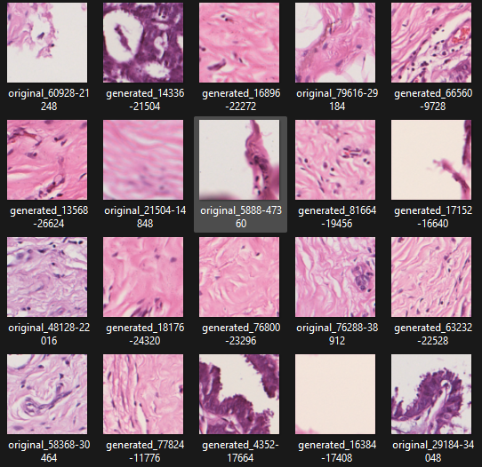

# I2SB Image Enhancement with FlashAttention

[](https://pytorch.org/)
[](https://developer.nvidia.com/cuda-toolkit)
[](https://github.com/HazyResearch/flash-attention)

## Introduction
This project implements the Image-to-Image Schrödinger Bridge (I2SB) algorithm for image enhancement. The model leverages FlashAttention to accelerate training and inference, significantly improving computational efficiency. The I2SB backbone refines image quality by learning an optimal transition path between degraded and high-quality images.

## Example Results
<<<<<<< HEAD
 
=======


>>>>>>> f11f02bd243f03a25d8ce80576d970ce63c1f138

## Hardware & Environment Setup
- **GPU**: NVIDIA RTX 3080 Ti (12GB VRAM)
- **OS**: Ubuntu (via WSL) due to Jupyter Notebook limitations on Windows
- **CUDA Version**: 12.6
- **PyTorch Version**: 2.3.1 (CUDA-enabled)
- **FlashAttention Version**: 2.7.0
- **Frameworks**: PyTorch, torchvision, FlashAttention

## Challenges & Solutions
- **FlashAttention Build Issues**: Required pre-built wheels and careful environment setup
- **Jupyter Notebook Worker Limitation**: Jupyter does not support num_workers > 0, so we moved to WSL for multi-core processing
- **GPU Out of Memory (OOM) Errors**: Optimized batch size, enabled AMP (Automatic Mixed Precision), and adjusted prefetching & memory pinning

## Hyperparameter Configuration

| Parameter | Value | Reason |
|-----------|--------|---------|
| Batch Size | 64 | Optimal for 12GB VRAM, preventing OOM errors |
| Learning Rate | 1e-4 | Prevents instability while ensuring fast convergence |
| Epochs | 15 | Sufficient for convergence without overfitting |
| Image Size | 128x128 | Reduces memory footprint while maintaining quality |
| Normalization | Mean=(0.5,0.5,0.5) | Keeps values in a stable range for training |
| Workers | 8 | Matches CPU core count for efficient data loading |
| Prefetch Factor | 2 | Improves data pipeline performance |
| Pin Memory | True | Speeds up host-to-GPU memory transfer |

## Results & Performance

```json
{
    "average_psnr": 32.18,
    "average_ssim": 0.985,
    "average_processing_time_ms": 0.252,
    "total_processing_time_seconds": 1127.52,
    "total_patches_processed": 29219,
    "min_psnr": 18.63,
    "max_psnr": 35.40,
    "min_ssim": 0.320,
    "max_ssim": 0.995
}
```

## Getting Started
1. Clone the repository
2. Install dependencies:
```bash
pip install torch==2.3.1 flash-attn==2.7.0 torchvision
```
3. Ensure CUDA 12.6 is installed
4. Run the training script

## License
MIT License
